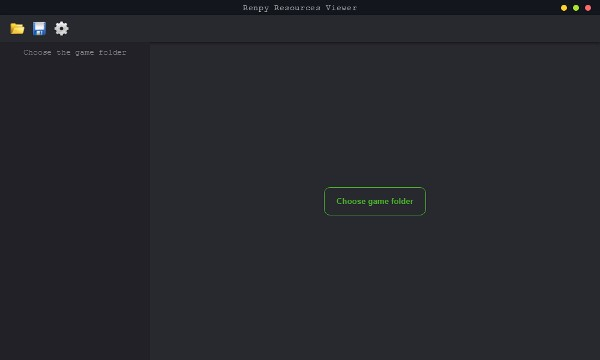
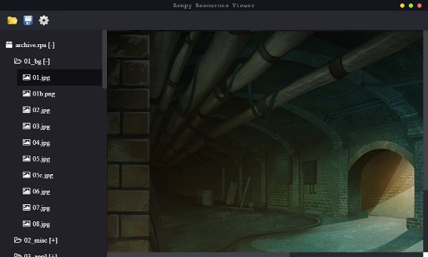
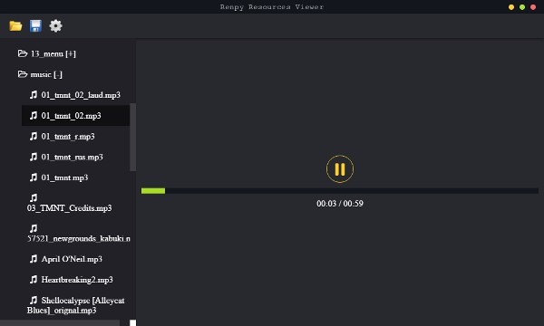
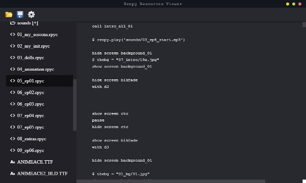
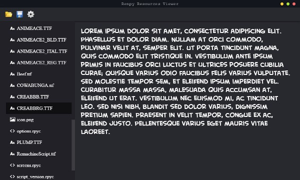

# Ren'Py Resources Viewer

> Open .rpa, rpy and .rpyc files.

#### Screenshots






#### Build Setup

``` bash
# install dependencies
npm install

# serve with hot reload at localhost:9080
npm run dev

# build electron application for production
npm run build


# lint all JS/Vue component files in `src/`
npm run lint

```

#### TODO
* Сохранять настройки в файл
* Редактировать и сохранять скрипты
* Редактор сохранений ??
* Extract all

#### Fixme
* Python error: `UnicodeDecodeError: 'utf8' codec can't decode byte 0xcb in position 19: invalid continuation byte` (Скорее всего старый формат rpyc или rpa)
* Witches не конвертируется файл `scripts.rpa/scripts/intro/intro_2/intro_2_ch0_dialogue.rpyc`

---

This project was generated with [electron-vue](https://github.com/SimulatedGREG/electron-vue)@[4c6ee7b](https://github.com/SimulatedGREG/electron-vue/tree/4c6ee7bf4f9b4aa647a22ec1c1ca29c2e59c3645) using [vue-cli](https://github.com/vuejs/vue-cli). Documentation about the original structure can be found [here](https://simulatedgreg.gitbooks.io/electron-vue/content/index.html).
